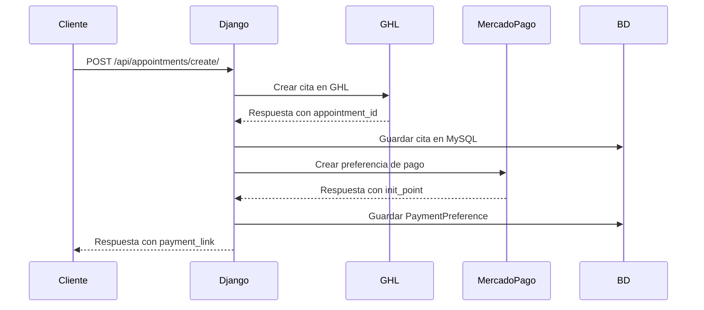
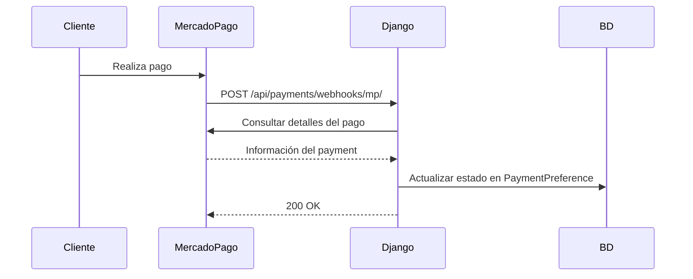

# 📅 Sistema de Gestión de Citas con Integración de Pagos

[](https://github.com/Jaime-D-Z/payments-and-appoinemnts-ghl)
[](https://www.python.org/)
[](https://www.djangoproject.com/)
[](https://www.mysql.com/)

Sistema Django para gestionar citas a través de **GoHighLevel (GHL)** con integración automática de pagos mediante **Mercado Pago**.

## 🎯 Características Principales

- ✅ **Creación de citas** en GHL con generación automática de link de pago
- 💳 **Integración completa con Mercado Pago** para procesar pagos
- 🔔 **Webhooks bidireccionales** (GHL ↔ Django ↔ Mercado Pago)
- 📊 **Almacenamiento persistente** de citas y preferencias de pago
- 🔄 **Sincronización en tiempo real** con GoHighLevel
- 🛡️ **Manejo robusto de errores** y validaciones
- 📝 **Actualización y cancelación** de citas

## 📋 Requisitos Previos

Antes de comenzar, asegúrate de tener instalado:

- **Python 3.8 o superior**
- **MySQL 5.7 o superior**
- **pip** (gestor de paquetes de Python)
- **virtualenv** (recomendado)
- Cuenta activa en **GoHighLevel** con acceso API
- Cuenta de **Mercado Pago** (Sandbox para desarrollo o Producción)
- **Ngrok** (para desarrollo local) o servidor con dominio público

## 🚀 Instalación Rápida

### 1. Clonar el repositorio

```bash
git clone https://github.com/Jaime-D-Z/payments-and-appoinemnts-ghl.git
cd payments-and-appoinemnts-ghl
```

### 2. Crear y activar entorno virtual

```bash
# Crear entorno virtual
python -m venv venv

# Activar en Windows
venv\Scripts\activate

# Activar en Linux/Mac
source venv/bin/activate
```

### 3. Instalar dependencias

```bash
pip install -r requirements.txt
```

### 4. Configurar variables de entorno

Copia el archivo de ejemplo y configura tus credenciales:

```bash
cp .env.example .env
```

Edita el archivo `.env` con tus datos:

```env
# ===============================
# 🔐 GHL API (GoHighLevel)
# ===============================
GHL_API_KEY=tu_ghl_api_key_aqui
GHL_LOCATION_ID=tu_ghl_location_id_aqui
GHL_ACCESS_TOKEN=tu_ghl_access_token_aqui

# ===============================
# 💳 Mercado Pago (Sandbox / Production)
# ===============================
MP_ACCESS_TOKEN=tu_mp_access_token_aqui
MP_PUBLIC_KEY=tu_mp_public_key_aqui
MP_BASE_URL=https://api.mercadopago.com
MP_WEBHOOK_SECRET=tu_mp_webhook_secret_aqui

# ===============================
# 🌐 Webhook público (Ngrok o servidor real)
# ===============================
PUBLIC_WEBHOOK_URL=https://tu-dominio-publico.ngrok-free.app

# ===============================
# 🗄️ Base de Datos MySQL
# ===============================
DB_NAME=nombre_de_tu_base_datos
DB_USER=usuario_mysql
DB_PASSWORD=contraseña_mysql
DB_HOST=127.0.0.1
DB_PORT=3306
```

### 5. Configurar base de datos

```bash
# Crear base de datos en MySQL
mysql -u root -p
CREATE DATABASE nombre_de_tu_base_datos;
exit;

# Crear migraciones
python manage.py makemigrations

# Aplicar migraciones
python manage.py migrate
```

### 6. Ejecutar el servidor

```bash
python manage.py runserver
```

El servidor estará disponible en: `http://127.0.0.1:8000/`

## 📂 Estructura del Proyecto

```
reflexoperu/
├── apps/
│   ├── appointments/              # 📅 Módulo de Citas
│   │   ├── migrations/
│   │   ├── __pycache__/
│   │   ├── __init__.py
│   │   ├── admin.py              # Admin de Django
│   │   ├── apps.py               # Configuración de la app
│   │   ├── models.py             # Modelo Appointment
│   │   ├── serializers.py        # Serializers DRF
│   │   ├── tests.py              # Tests unitarios
│   │   ├── urls.py               # Rutas de appointments
│   │   └── views.py              # Vistas y lógica principal
│   │
│   └── payments/                  # 💳 Módulo de Pagos
│       ├── migrations/
│       ├── __pycache__/
│       ├── __init__.py
│       ├── admin.py              # Admin de Django
│       ├── apps.py               # Configuración de la app
│       ├── models.py             # Modelo PaymentPreference
│       ├── tests.py              # Tests unitarios
│       ├── urls.py               # Rutas de payments
│       ├── utils.py              # Utilidades MP (create_mp_preference)
│       └── views.py              # Vistas de pagos y webhooks
│
├── reflexoperu/                   # ⚙️ Configuración del proyecto
│   ├── __init__.py
│   ├── asgi.py
│   ├── settings.py               # Configuración principal
│   ├── urls.py                   # URLs principales
│   └── wsgi.py
│
├── venv/                          # 🐍 Entorno virtual
├── .env                           # 🔐 Variables de entorno (no versionado)
├── .env.example                   # 📝 Plantilla de variables
├── .gitignore                     # 🚫 Archivos ignorados por Git
├── manage.py                      # 🎛️ CLI de Django
├── README.md                      # 📖 Este archivo
└── requirements.txt               # 📦 Dependencias del proyecto
```

## 📡 API Endpoints

### 🔷 Módulo: Appointments

#### 📌 Crear Cita con Link de Pago
**Endpoint:** `POST /api/appointments/create/`

**Descripción:** Crea una cita en GHL, la guarda en la base de datos local y genera automáticamente un link de pago de Mercado Pago.

**Request Body:**
```json
{
  "calendarId": "calendar_id_de_ghl",
  "contactId": "contact_id_de_ghl",
  "startTime": "2025-10-20T10:00:00Z",
  "endTime": "2025-10-20T11:00:00Z",
  "payment_amount": 100.00,
  "title": "Consulta Médica",
  "payment_description": "Pago por consulta médica",
  "appointmentStatus": "confirmed"
}
```

**Campos requeridos:**
- `calendarId`: ID del calendario de GHL
- `contactId`: ID del contacto en GHL
- `startTime`: Fecha/hora de inicio (ISO 8601)
- `endTime`: Fecha/hora de fin (ISO 8601)
- `payment_amount`: Monto del pago (decimal)

**Respuesta exitosa (201 Created):**
```json
{
  "id": 1,
  "ghl_id": "appointment_ghl_id_123",
  "location_id": "location_id",
  "calendar_id": "calendar_id",
  "contact_id": "contact_id",
  "title": "Consulta Médica",
  "appointment_status": "confirmed",
  "start_time": "2025-10-20T10:00:00Z",
  "end_time": "2025-10-20T11:00:00Z",
  "payment_link": "https://www.mercadopago.com/mpe/checkout/start?pref_id=123456",
  "payment_preference_id": "123456-abc-def",
  "message": "Cita y link de pago creados."
}
```

---

#### 📌 Actualizar Cita
**Endpoint:** `PUT /api/appointments/update/<appointment_id>/`

**Request Body:**
```json
{
  "title": "Consulta Actualizada",
  "appointmentStatus": "confirmed",
  "startTime": "2025-10-20T11:00:00Z",
  "endTime": "2025-10-20T12:00:00Z",
  "notes": "Notas adicionales"
}
```

---

#### 📌 Cancelar/Eliminar Cita
**Endpoint:** `DELETE /api/appointments/delete/<appointment_id>/`

**Respuesta:**
```json
{
  "message": "Cita cancelada correctamente"
}
```

---

#### 📌 Listar Todas las Citas
**Endpoint:** `GET /api/appointments/appointments/`

**Respuesta:**
```json
[
  {
    "id": 1,
    "ghl_id": "appointment_123",
    "title": "Consulta Médica",
    "appointment_status": "confirmed",
    "start_time": "2025-10-20T10:00:00Z",
    "end_time": "2025-10-20T11:00:00Z",
    "contact_id": "contact_id"
  },
  ...
]
```

---

#### 📌 Webhook de GHL
**Endpoint:** `POST /api/appointments/webhooks/ghl/appointments/`

**Descripción:** Recibe notificaciones de GoHighLevel cuando se crea, actualiza o elimina una cita.

**Eventos soportados:**
- `AppointmentCreate`
- `AppointmentUpdate`
- `AppointmentDelete`

---

### 🔷 Módulo: Payments

#### 📌 Crear Link de Pago Manual
**Endpoint:** `POST /api/payments/create/`

**Request Body:**
```json
{
  "appointment_ghl_id": "appointment_id_123",
  "contact_id": "contact_id",
  "amount": 150.00,
  "description": "Pago por servicio adicional"
}
```

---

#### 📌 Webhook de Mercado Pago
**Endpoint:** `POST /api/payments/webhooks/mp/`

**Descripción:** Recibe notificaciones de Mercado Pago sobre el estado de los pagos.

**Eventos procesados:**
- `payment.created`
- `payment.updated`

---

## 🔧 Configuración de Webhooks

### 🔹 GoHighLevel

1. Inicia sesión en tu cuenta de GHL
2. Ve a **Settings** → **Integrations** → **Webhooks**
3. Haz clic en **Add Webhook**
4. Configura:
   - **URL:** `https://tu-dominio.com/api/appointments/webhooks/ghl/appointments/`
   - **Eventos:** Selecciona:
     - ✅ AppointmentCreate
     - ✅ AppointmentUpdate
     - ✅ AppointmentDelete
5. Guarda la configuración

---

### 🔹 Mercado Pago

1. Inicia sesión en tu cuenta de Mercado Pago
2. Ve a [Panel de Webhooks](https://www.mercadopago.com.pe/developers/panel/webhooks)
3. Haz clic en **Agregar URL**
4. Configura:
   - **URL:** `https://tu-dominio.com/api/payments/webhooks/mp/`
   - **Eventos:** Selecciona `payment`
5. Guarda y copia el **Webhook Secret** a tu `.env` (`MP_WEBHOOK_SECRET`)

---

### 🔹 Desarrollo Local con Ngrok

Para probar webhooks en desarrollo local:

```bash
# Instalar ngrok (si no lo tienes)
# https://ngrok.com/download

# Exponer puerto 8000
ngrok http 8000

# Resultado:
# Forwarding: https://abc123.ngrok-free.app -> http://localhost:8000
```

Copia la URL pública (`https://abc123.ngrok-free.app`) y actualiza:
- `PUBLIC_WEBHOOK_URL` en tu `.env`
- URLs de webhooks en GHL y Mercado Pago

---

## 🗄️ Modelos de Base de Datos

### 📌 Appointment (apps/appointments/models.py)

```python
class Appointment(models.Model):
    ghl_id = CharField(unique=True)              # ID único de GHL
    location_id = CharField()                     # ID de ubicación GHL
    calendar_id = CharField()                     # ID del calendario
    contact_id = CharField()                      # ID del contacto
    title = CharField(max_length=255)            # Título de la cita
    appointment_status = CharField()              # Estado: confirmed, cancelled, etc.
    assigned_user_id = CharField(nullable=True)  # Usuario asignado
    notes = TextField(nullable=True)             # Notas adicionales
    start_time = DateTimeField(nullable=True)    # Fecha/hora inicio
    end_time = DateTimeField(nullable=True)      # Fecha/hora fin
    source = CharField(nullable=True)            # Fuente de la cita
    date_added = DateTimeField(nullable=True)    # Fecha de creación
    date_updated = DateTimeField(nullable=True)  # Última actualización
```

---

### 📌 PaymentPreference (apps/payments/models.py)

```python
class PaymentPreference(models.Model):
    appointment_ghl_id = CharField()             # ID de la cita relacionada
    contact_id = CharField()                     # ID del contacto
    amount = DecimalField(max_digits=10, decimal_places=2)  # Monto
    description = TextField()                    # Descripción del pago
    preference_id = CharField(unique=True)       # ID de preferencia MP
    init_point = URLField()                      # Link de pago MP
    status = CharField(default="pending")        # Estado: pending, approved, rejected
    created_at = DateTimeField(auto_now_add=True)
    updated_at = DateTimeField(auto_now=True)
```

---

## 🔄 Flujo de Trabajo del Sistema

### 📍 Flujo 1: Creación de Cita con Pago



**Pasos:**
1. El cliente envía solicitud con datos de la cita
2. Django crea la cita en GoHighLevel
3. GHL devuelve el ID de la cita
4. Django guarda la cita en MySQL
5. Django llama a `create_mp_preference()` para generar link de pago
6. Mercado Pago devuelve el link de pago
7. Django guarda la preferencia en `PaymentPreference`
8. Django devuelve al cliente la cita + link de pago

---

### 📍 Flujo 2: Webhook de Mercado Pago



---

## 🧪 Testing

### Ejecutar todas las pruebas

```bash
python manage.py test
```

### Ejecutar pruebas específicas

```bash
# Solo appointments
python manage.py test apps.appointments

# Solo payments
python manage.py test apps.payments
```

### Crear superusuario para Django Admin

```bash
python manage.py createsuperuser
```

Accede al admin en: `http://127.0.0.1:8000/admin/`

---

## 🐛 Solución de Problemas Comunes

### ❌ Error: "Access Token de GHL no configurado"
**Solución:** Verifica que `GHL_ACCESS_TOKEN` esté configurado correctamente en tu archivo `.env`

---

### ❌ Error: "No se pudo generar el link de pago MP"
**Posibles causas:**
- Credenciales incorrectas de Mercado Pago
- Token expirado
- Problemas de conexión

**Solución:** 
- Verifica `MP_ACCESS_TOKEN` en `.env`
- Revisa los logs de Django para más detalles
- Prueba con las credenciales de Sandbox primero

---

### ❌ Webhooks no reciben notificaciones
**Solución:**
- Verifica que `PUBLIC_WEBHOOK_URL` apunte a una URL pública accesible
- Revisa que los webhooks estén configurados correctamente en GHL y MP
- Verifica que ngrok esté corriendo (en desarrollo local)
- Revisa los logs del servidor: `python manage.py runserver`

---

### ❌ Error de conexión a MySQL
**Solución:**
```bash
# Verifica que MySQL esté corriendo
sudo service mysql status

# Verifica credenciales en .env
DB_USER=tu_usuario
DB_PASSWORD=tu_contraseña
DB_NAME=tu_base_datos
```

---

## 📝 Logs y Debugging

El sistema utiliza logs con emojis para facilitar la identificación:

- ✅ **Operación exitosa**
- ❌ **Error crítico**
- 🟡 **Advertencia**
- ⚠️ **Evento no manejado**

**Ver logs en tiempo real:**
```bash
python manage.py runserver
# Los logs aparecerán en la consola
```

---

## 🚀 Deployment a Producción

### Checklist de Producción

- [ ] Cambiar `DEBUG = False` en `settings.py`
- [ ] Configurar `ALLOWED_HOSTS` con tu dominio
- [ ] Usar variables de entorno seguras
- [ ] Configurar base de datos MySQL optimizada
- [ ] Implementar backups automáticos
- [ ] Usar Gunicorn + Nginx
- [ ] Configurar SSL/HTTPS (Let's Encrypt)
- [ ] Implementar rate limiting
- [ ] Usar credenciales de Producción de Mercado Pago
- [ ] Configurar monitoreo y alertas

### Ejemplo con Gunicorn

```bash
# Instalar gunicorn
pip install gunicorn

# Ejecutar
gunicorn reflexoperu.wsgi:application --bind 0.0.0.0:8000
```

---

## 📊 Variables de Entorno Completas

```env
# GHL API
GHL_API_KEY=your_ghl_api_key_here
GHL_LOCATION_ID=your_ghl_location_id_here
GHL_ACCESS_TOKEN=your_ghl_access_token_here
GHL_API_VERSION=2021-04-15

# Mercado Pago
MP_ACCESS_TOKEN=your_mp_access_token_here
MP_PUBLIC_KEY=your_mp_public_key_here
MP_BASE_URL=https://api.mercadopago.com
MP_WEBHOOK_SECRET=your_mp_webhook_secret_here

# Webhooks
PUBLIC_WEBHOOK_URL=https://your-domain.com

# Base de Datos
DB_NAME=your_database_name
DB_USER=your_database_user
DB_PASSWORD=your_database_password
DB_HOST=127.0.0.1
DB_PORT=3306

# Django
SECRET_KEY=your_django_secret_key
DEBUG=False
ALLOWED_HOSTS=localhost,127.0.0.1,your-domain.com
```

---

## 🤝 Contribución

¿Quieres contribuir? ¡Genial!

1. Fork el proyecto
2. Crea una rama para tu feature (`git checkout -b feature/AmazingFeature`)
3. Commit tus cambios (`git commit -m 'Add some AmazingFeature'`)
4. Push a la rama (`git push origin feature/AmazingFeature`)
5. Abre un Pull Request

---

## 📞 Soporte y Contacto

- **GitHub Issues:** [Reportar un problema](https://github.com/Jaime-D-Z/payments-and-appoinemnts-ghl/issues)
- **Documentación GHL:** [GoHighLevel API Docs](https://marketplace.gohighlevel.com/docs/)
- **Documentación MP:** [Mercado Pago Developers](https://www.mercadopago.com.pe/developers/es)

---

## 📄 Licencia

Este proyecto es privado y confidencial. Todos los derechos reservados.

---

## 🙏 Agradecimientos

- **GoHighLevel** por su robusta API de gestión de citas
- **Mercado Pago** por facilitar el procesamiento de pagos
- **Django REST Framework** por su excelente framework

---

<div align="center">

**⭐ Desarrollado con Django REST Framework ⭐**

[](https://github.com/Jaime-D-Z)

</div>
